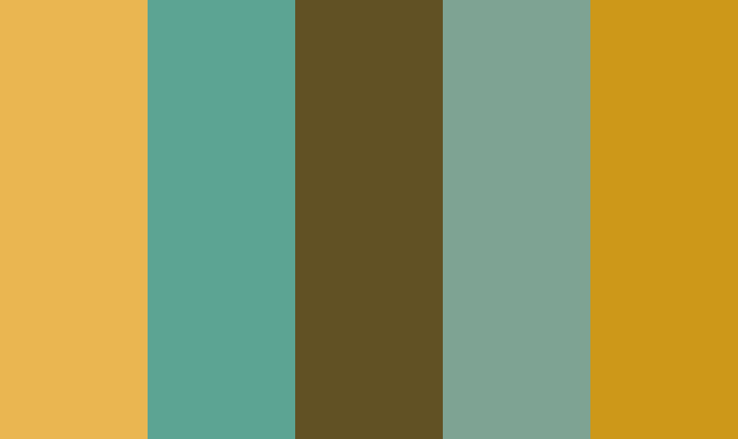

# Color Extractor
This Python script extracts the most dominant colors from one or more images using the KMeans clustering algorithm. It saves the colors to a text file and a JSON file, and creates a color palette image for each input image.

## Table of Contents
- Installation
- Usage
- Output
- License
- Installation

### The script requires the following Python libraries:

- sklearn
- numpy
- argparse
- csv
- json
- PIL (Pillow)
- termcolor
- matplotlib
You can install these with pip:
```bash
pip install scikit-learn  numpy argparse csv json pillow matplotlib termcolor
```

### Usage
You can run the script from the command line like this:

```python
python script.py -p image1.jpg image2.jpg -n 5 -o colors_palette
```

Replace 'image1.jpg' and 'image2.jpg' with the paths to your image files, and 5 with the number of colors you want to extract. The -o argument is optional; if you don’t provide it, the script will use 'colors_palette' as the default output file name.

### Output
The script will create a text file, a JSON file, and a color palette image for each input image. The text and JSON files contain the most dominant colors in hexadecimal format. The color palette image shows the colors as horizontal bars.

| Image             |  Color palette |
:-------------------------:|:-------------------------:
  |  
  |  
  |  
  |  
  |  
  |  

### License
This project is licensed under the terms of the MIT license.

This README provides a brief overview of the script, instructions on how to install and use it, and information about the output. You can add more sections as needed, such as ‘Contributing’, ‘Credits’, and ‘Acknowledgments’. If you encounter any issues, please let me know! I’m here to help. 😊

